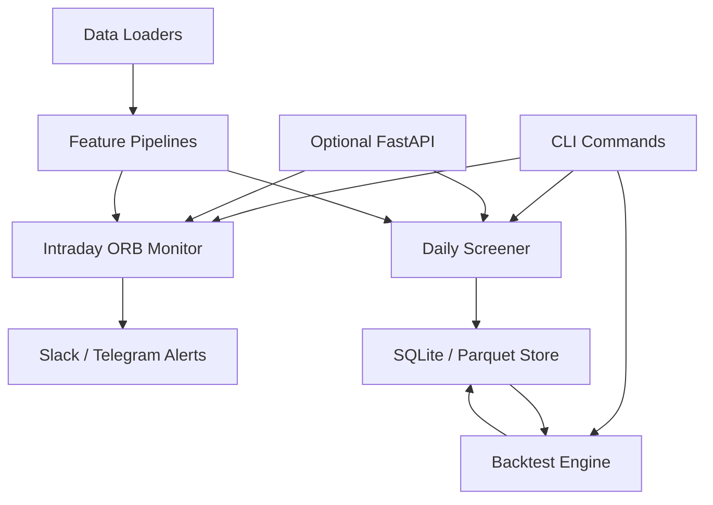

# Design Overview

This design highlights the core data and signal flow for KR-ORB-Filter based on current requirements.

Key decisions:

- Keep data ingestion and feature calculation isolated to simplify unit testing and reuse.
- Route alerts through a shared notifier layer so delivery providers share throttling and logging logic.
- Persist all screen/backtest outputs to the store to support reproducible research and reporting.