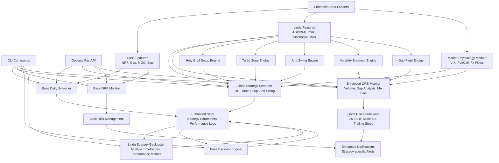
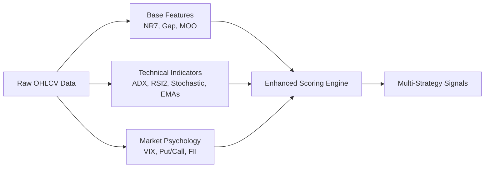
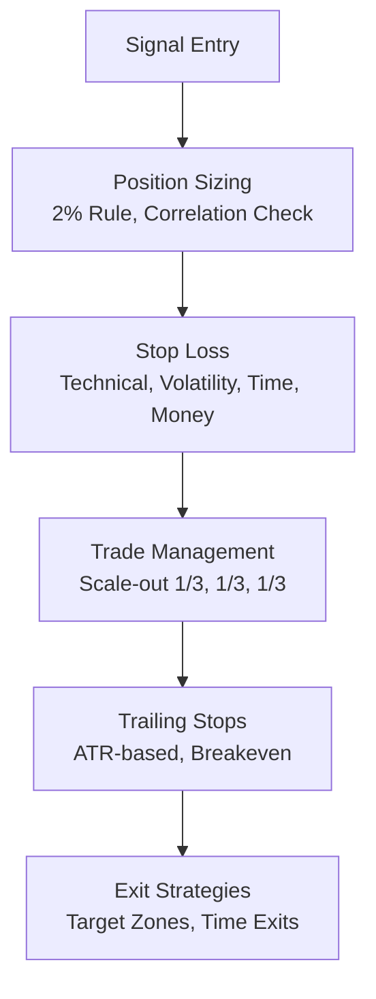
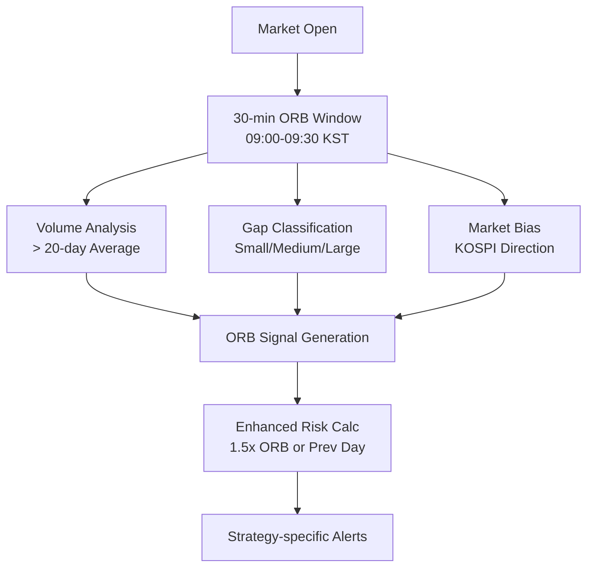
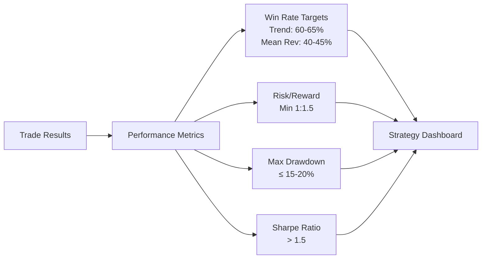

# Design Overview - Linda Raschke Integration

This design extends the core KR-ORB-Filter system to incorporate Linda Raschke's proven trading methodologies while maintaining the existing architecture's modularity and performance.



## Key Design Decisions

### 1. Modular Strategy Integration
- **Parallel Architecture**: Linda strategies run alongside existing base strategies without interference
- **Shared Infrastructure**: Leverage existing data loaders, storage, and notification systems
- **Strategy Isolation**: Each Linda strategy (HG, Turtle Soup, etc.) is implemented as a separate module
- **Configuration Driven**: All Linda parameters configurable via environment and config files

### 2. Enhanced Feature Pipeline


### 3. Risk Management Enhancement


### 4. Strategy-Specific Components

#### Holy Grail Setup Engine
- **Trend Detection**: ADX > 30 filter with ±DI confirmation
- **Pullback Identification**: 3-5 bar retracement detection
- **Momentum Divergence**: RSI oversold/overbought in pullback
- **Entry Confirmation**: Break of pullback high/low

#### Turtle Soup Engine
- **20-Day Range Tracking**: Rolling high/low calculation
- **Failed Breakout Detection**: Break above/below with close failure
- **Reversal Confirmation**: Next day trade through opposite level
- **Risk Management**: Stop beyond failed breakout level

#### Anti-Swing Engine
- **Extreme Condition Detection**: 2-day RSI < 10 or > 90
- **Counter-Trend Setup**: After 2-3 days strong directional move
- **Entry Timing**: Stochastic crossover confirmation
- **Mean Reversion Target**: 5-period moving average

### 5. Enhanced ORB Monitor


### 6. Performance Metrics Integration


## Data Flow Architecture

### 1. Pre-Market Analysis (Pre-09:00 KST)
1. **Data Ingestion**: Download overnight data, foreign market results
2. **Feature Calculation**: Compute all technical indicators and Linda features
3. **Screening**: Run both base and Linda strategy screens
4. **Bias Determination**: Assess overall market direction using multiple timeframes
5. **Alert Preparation**: Queue potential setups for intraday monitoring

### 2. Trading Session (09:00-15:30 KST)
1. **Opening Analysis**: Monitor gaps, volume, and ORB formation
2. **Pattern Recognition**: Real-time detection of HG, Turtle Soup, Anti-Swing setups
3. **Signal Generation**: Coordinate multiple strategy signals with priority weighting
4. **Risk Management**: Apply Linda's risk framework to all generated signals
5. **Alert Distribution**: Send strategy-specific notifications via Slack/Telegram

### 3. Post-Market Analysis (Post-15:30 KST)
1. **Trade Journaling**: Log all signals, entries, exits, and reasoning
2. **Performance Review**: Calculate strategy-specific metrics and comparisons
3. **Strategy Adjustment**: Analyze market conditions for parameter optimization
4. **Reporting**: Generate daily/weekly/monthly performance summaries

## Technical Implementation Strategy

### 1. Backward Compatibility
- Existing base system functionality remains unchanged
- New Linda features are additive, not replacements
- Configuration allows selective enabling/disabling of Linda strategies
- Existing users can gradually adopt Linda enhancements

### 2. Performance Optimization
- Vectorized calculations for all Linda indicators using NumPy/Pandas
- Efficient caching of expensive computations (ADX, EMAs)
- Parallel processing for multiple strategy evaluations
- Memory-efficient handling of multi-timeframe data

### 3. Configuration Management
```python
# Enhanced config structure
LINDA_STRATEGIES = {
    'holy_grail': {
        'enabled': True,
        'adx_threshold': 30,
        'pullback_bars': [3, 4, 5],
        'rsi_oversold': 30,
        'rsi_overbought': 70
    },
    'turtle_soup': {
        'enabled': True,
        'lookback_days': 20,
        'confirmation_required': True
    },
    'anti_swing': {
        'enabled': True,
        'rsi2_oversold': 10,
        'rsi2_overbought': 90,
        'target_ma_period': 5
    }
}
```

### 4. Testing Strategy
- Unit tests for each Linda strategy component
- Integration tests for multi-strategy coordination
- Backtesting validation against known historical patterns
- Performance benchmarking against base system
- A/B testing framework for strategy comparison

This design ensures Linda Raschke's methodologies are seamlessly integrated while maintaining the system's reliability, performance, and extensibility.